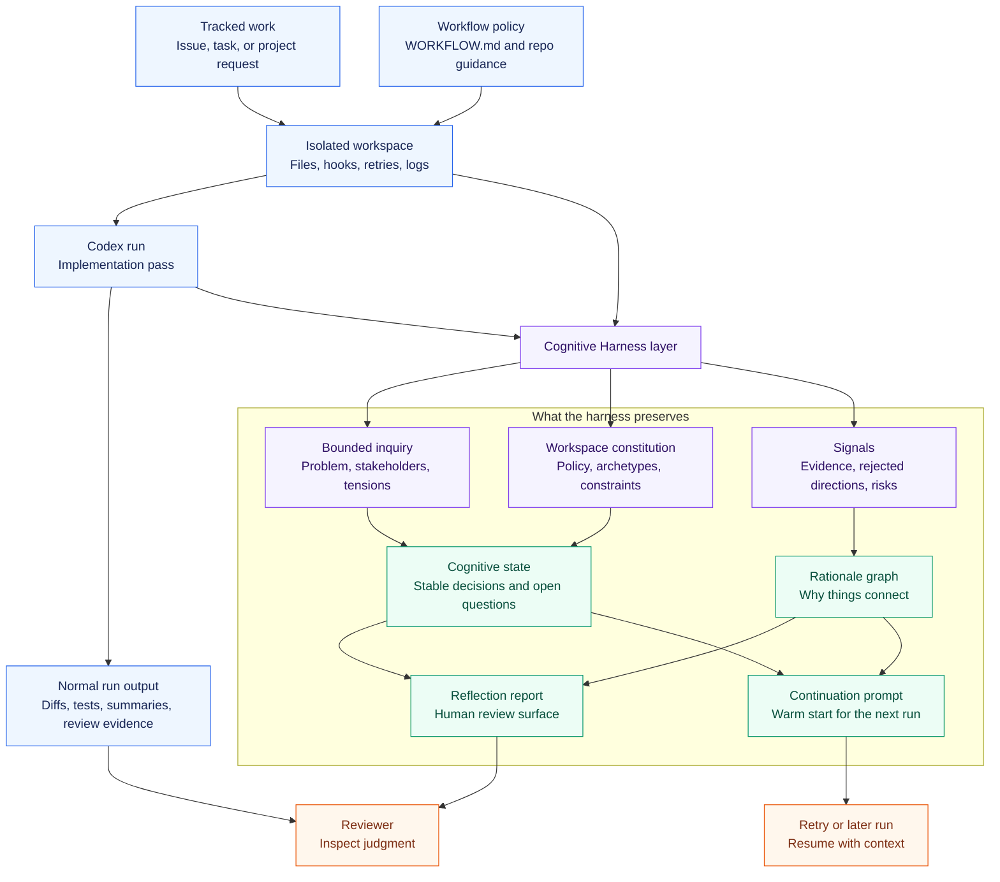

# Cognitive Harness

Cognitive Harness is a working demo for cognition-shaped workspaces on top of Symphony primitives.

Symphony already gives Codex a strong execution substrate: tracked work becomes an isolated run,
the run has lifecycle hooks, retries, observable output, and a review path. Cognitive Harness asks
what should live around that execution layer so reasoning can compound instead of evaporate.

The concrete demo lives under:

```text
examples/cognitive-harness/
```



## The Problem

Agent runs produce more than code and logs. They also produce working judgment:

- which assumptions held up
- which directions were rejected
- which tradeoffs still matter
- which risks need review
- which questions need evidence
- where the next run should begin

Raw transcripts can contain that information, but they make it expensive to recover. A later run has
to reread the past. A human reviewer has to infer the reasoning structure. A retry can restart from
the task description and repeat work the previous run already did.

## The Proposal

Cognitive Harness treats the workspace as a bounded cognitive environment.

Each run gets 3 inputs:

- `inquiry.json`: the bounded problem space
- `constitution.json`: the workspace policy and reasoning archetypes
- `signals.json`: evidence, rejected directions, questions, and risks

The runtime writes 5 artifacts:

- `COGNITIVE_STATE.json`: what the next run should preserve
- `RATIONALE_GRAPH.json`: how evidence, tensions, decisions, risks, and questions connect
- `REFLECTION_REPORT.md`: what a human reviewer should inspect
- `CONTINUATION_PROMPT.md`: where a continuation run should begin
- `RUN_SUMMARY.json`: operational counts and generated paths

The implementation is intentionally small and deterministic. The contribution is the shape: what
gets preserved, how it is connected, and how that state could attach to real Symphony runs.

## Why It Fits Symphony And Codex

Symphony is framed around autonomous implementation runs. That makes it a natural carrier for this
idea because it already has the right boundaries: issue, workspace, workflow, agent session, retry,
observability, and review.

Cognitive Harness sits beside those pieces as a cognition layer inside the workspace:

| Existing Symphony primitive | Cognitive Harness interpretation |
| --- | --- |
| Issue | bounded inquiry |
| `WORKFLOW.md` | workspace constitution |
| Workspace | persistent cognitive environment |
| Agent session | reasoning pass |
| Retry | recovery from preserved state |
| Observability | state, graph, reflection, and run summary |
| Human review | explicit judgment over unresolved questions |

This also matches the spirit of Codex harness work: make the environment around the model legible,
versioned, testable, and reviewable. The demo applies that idea to reasoning state.

Related OpenAI framing:

- [Harness engineering](https://openai.com/index/harness-engineering/) emphasizes designing environments, feedback loops, and repository-local knowledge that agents can inspect.
- [Symphony](https://github.com/openai/symphony) turns tracked project work into isolated implementation runs.
- [Symphony SPEC.md](https://github.com/openai/symphony/blob/main/SPEC.md) defines the service boundary this demo builds beside.

## What The Demo Shows

The case study is intentionally generic: a complex product onboarding inquiry.

It includes:

- 5 stakeholders
- 3 preserved tensions
- 3 simulated evidence signals
- 2 stable decisions
- 2 rejected directions
- 5 open questions
- 2 known risks
- 28 rationale graph edges

The product onboarding case study is the carrier. The handoff surface is the transferable part: a
future run or reviewer can see stable decisions, active tensions, open questions, and risks without
reconstructing them from a transcript.

## Challenge Areas

Continuity is the runnable use case in this branch. The broader harness pattern applies to more than
continuation.

- **Continuity loss**: later runs repeat exploration or miss prior constraints.
- **Tension collapse**: unresolved tradeoffs get smoothed into a tidy summary.
- **Weak review surfaces**: reviewers see outputs without the reasoning structure around them.
- **Brittle recovery**: retries restart from task text instead of accumulated state.
- **Domain drift**: every team invents a memory shape that later becomes hard to compare or reuse.

The harness should preserve cognition that matters, expose cognition that still needs judgment, and
keep both inspectable.

## How To Try It

Run from the repository root:

```bash
node examples/cognitive-harness/runtime.mjs
```

Then inspect:

- [COGNITIVE_STATE.json](examples/cognitive-harness/sample-output/COGNITIVE_STATE.json)
- [RATIONALE_GRAPH.json](examples/cognitive-harness/sample-output/RATIONALE_GRAPH.json)
- [REFLECTION_REPORT.md](examples/cognitive-harness/sample-output/REFLECTION_REPORT.md)
- [CONTINUATION_PROMPT.md](examples/cognitive-harness/sample-output/CONTINUATION_PROMPT.md)
- [RUN_SUMMARY.json](examples/cognitive-harness/sample-output/RUN_SUMMARY.json)

The sample output is committed, so you can inspect a complete run before running Node locally.

## How To Apply It

Use the harness when work has durable ambiguity.

Good fits:

- design critique with unresolved stakeholder tension
- research synthesis with contradictory evidence
- architecture review with rejected alternatives and risk tradeoffs
- strategy work with assumptions, scenarios, and decision checkpoints
- long-running implementation work that may retry, pause, or hand off

Weak fits:

- one-command tasks
- tiny bug fixes
- tasks where the only useful state is pass or fail

To adapt it, replace the fixtures and keep the generated artifact contract stable. Start with
[ADAPT.md](examples/cognitive-harness/ADAPT.md).

## How To Integrate It

The current runtime is a demonstrator. It uses fixture data so the artifact shape is easy to inspect.

In a real Symphony or Codex harness, those fixtures would be replaced by live sources:

- issue or project brief for the inquiry
- `WORKFLOW.md`, `AGENTS.md`, or repo harness docs for the constitution
- tests, logs, traces, review comments, failed attempts, and agent notes for signals

The natural place for this layer is inside the workspace. A later run can load
`COGNITIVE_STATE.json`, and a reviewer can inspect `REFLECTION_REPORT.md` before deciding whether
the work is ready.

See [INTEGRATE.md](examples/cognitive-harness/INTEGRATE.md) for a practical repository layout and
lifecycle wiring.

## Future Development

The current branch is a working slice. Useful next steps:

- Load real Symphony run traces instead of simulated `signals.json`.
- Add lifecycle hooks that update `COGNITIVE_STATE.json` after failure, handoff, or review.
- Add schema validation for state and graph artifacts.
- Render the rationale graph as an interactive review surface.
- Compare multiple runs to detect repeated failures or recurring tensions.
- Explore whether `WORKFLOW.md` should expose cognition policy directly.

## Open Questions

- Which parts of cognitive state should be standardized across harnesses?
- Which parts should stay domain-specific?
- Should the state be written by the agent, by the orchestration layer, or by a post-run reflection step?
- How should stale or wrong memory be corrected?
- What is the right relationship between raw transcripts, compressed state, and human review?
- How much of this belongs in Symphony itself versus an example or external extension?

## Contribution Shape

This branch is designed to be easy to inspect:

- docs explain the concept and the implementation path
- fixtures show the input contract
- runtime shows the state transformation
- sample output shows the end state
- adaptation notes show how to make it your own
- integration notes show where it could live in a real harness

That keeps the contribution concrete while leaving room for discussion about where this layer should
live in the broader Codex and Symphony ecosystem.

## Useful Review Threads

If this branch starts a discussion, useful review questions are:

- Is the artifact contract the right level of abstraction?
- Should the state live inside each workspace, in a shared store, or both?
- Which lifecycle hook should update reflection state?
- Should `WORKFLOW.md` own cognition policy, or should that live in a separate harness doc?
- Which generated artifacts would be most useful to show in Symphony review output?
