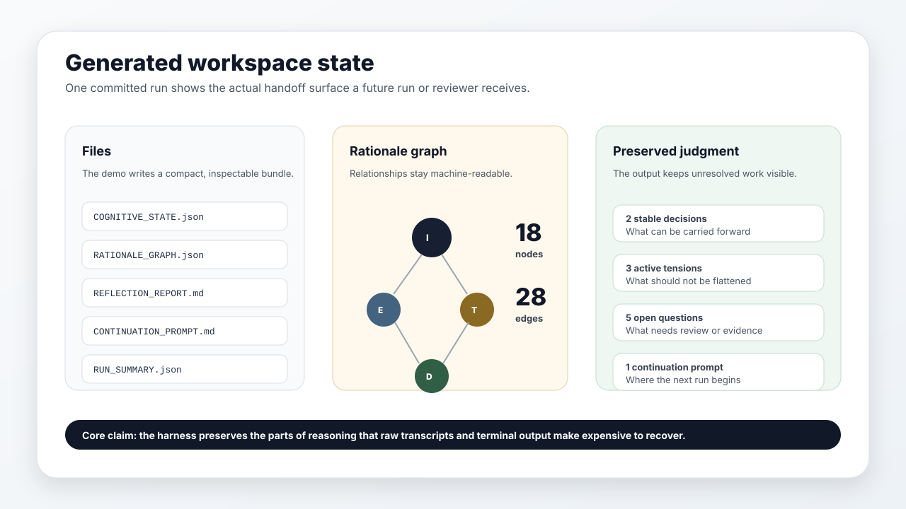

# Cognitive Harness

Cognitive Harness is a working demo for structured reasoning inside a Symphony-style workspace.

It gives an agent run a bounded inquiry, a workspace policy, preserved state, a rationale graph, a
reflection surface, and a continuation prompt.

The demo lives under:

```text
examples/cognitive-harness/
```



## The Challenge

Symphony can create isolated workspaces and run agents against tracked work. That gives the work a
clean execution boundary.

The next boundary is cognition. A later run should be able to see what already happened without
reading an entire transcript. A reviewer should be able to see unresolved judgment calls without
guessing which summary sentence hides them.

## The Direction

This branch treats the workspace as a cognitive harness.

A run reads a bounded inquiry, a workspace constitution, and simulated signals. It writes the state
the next run needs:

- stable decisions
- rejected directions
- active tensions
- open questions
- known risks
- evidence
- next actions
- a rationale graph connecting the pieces

The idea is inspired by cognitive scaffolding: make the working structure visible enough that the
next person or run can continue the thought without starting cold.

The current runtime is intentionally small and deterministic. The contribution is the shape: what
gets preserved, how it is connected, and where a future Symphony implementation could attach real
agent traces, review comments, tests, or operator notes.

## What Is Included

- `README.md` explains the demo.
- `CASE_STUDY.md` walks through the product onboarding example.
- `SPEC.md` defines the state contract.
- `ADAPT.md` shows how to make your own version.
- `runtime.mjs` runs the demo.
- `sample-output/` shows generated artifacts from one run.
- `media/` contains the preview images used in the docs.

Run it from the repo root:

```bash
node examples/cognitive-harness/runtime.mjs
```

The runtime writes:

- `COGNITIVE_STATE.json`
- `RATIONALE_GRAPH.json`
- `REFLECTION_REPORT.md`
- `CONTINUATION_PROMPT.md`
- `RUN_SUMMARY.json`

The sample output is committed, so the branch is inspectable even before you run it.
