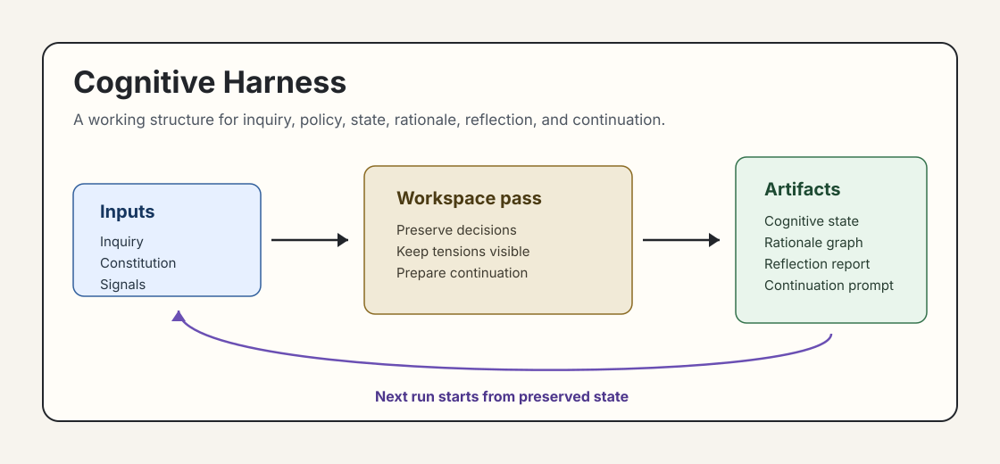

# Cognitive Harness

Branch demo for structured reasoning inside Symphony-style workspaces.

Symphony is already good at turning tracked work into isolated agent runs.

The fragile part is the handoff. When a run stops, retries, or needs human review, the next run
needs more than raw logs. It needs to know what stabilized, what was rejected, which tensions still
matter, and where to begin.

This branch proposes **Cognitive Harness**: a small working structure for bounded inquiry,
workspace policy, preserved reasoning state, rationale, reflection, and continuation.



## What You Will See

- A runnable example under `examples/cognitive-harness/`
- A product onboarding case study with 5 stakeholders and 3 preserved tensions
- A deterministic runtime that writes state, graph, reflection, continuation, and summary artifacts
- Committed sample output from one run, including 28 rationale graph edges
- A state contract and adaptation guide so the pattern can be reused

## Start Here

- [Branch overview](COGNITIVE_HARNESS.md)
- [Runnable demo](examples/cognitive-harness/)
- [Case study](examples/cognitive-harness/CASE_STUDY.md)
- [State contract](examples/cognitive-harness/SPEC.md)
- [Adaptation guide](examples/cognitive-harness/ADAPT.md)
- [Sample output](examples/cognitive-harness/sample-output/)

Run it from the repo root:

```bash
node examples/cognitive-harness/runtime.mjs
```

The original Symphony README continues below.

# Symphony

Symphony turns project work into isolated, autonomous implementation runs, allowing teams to manage
work instead of supervising coding agents.

[](.github/media/symphony-demo.mp4)

_In this [demo video](.github/media/symphony-demo.mp4), Symphony monitors a Linear board for work and spawns agents to handle the tasks. The agents complete the tasks and provide proof of work: CI status, PR review feedback, complexity analysis, and walkthrough videos. When accepted, the agents land the PR safely. Engineers do not need to supervise Codex; they can manage the work at a higher level._

> [!WARNING]
> Symphony is a low-key engineering preview for testing in trusted environments.

## Running Symphony

### Requirements

Symphony works best in codebases that have adopted
[harness engineering](https://openai.com/index/harness-engineering/). Symphony is the next step --
moving from managing coding agents to managing work that needs to get done.

### Option 1. Make your own

Tell your favorite coding agent to build Symphony in a programming language of your choice:

> Implement Symphony according to the following spec:
> https://github.com/openai/symphony/blob/main/SPEC.md

### Option 2. Use our experimental reference implementation

Check out [elixir/README.md](elixir/README.md) for instructions on how to set up your environment
and run the Elixir-based Symphony implementation. You can also ask your favorite coding agent to
help with the setup:

> Set up Symphony for my repository based on
> https://github.com/openai/symphony/blob/main/elixir/README.md

---

## License

This project is licensed under the [Apache License 2.0](LICENSE).
