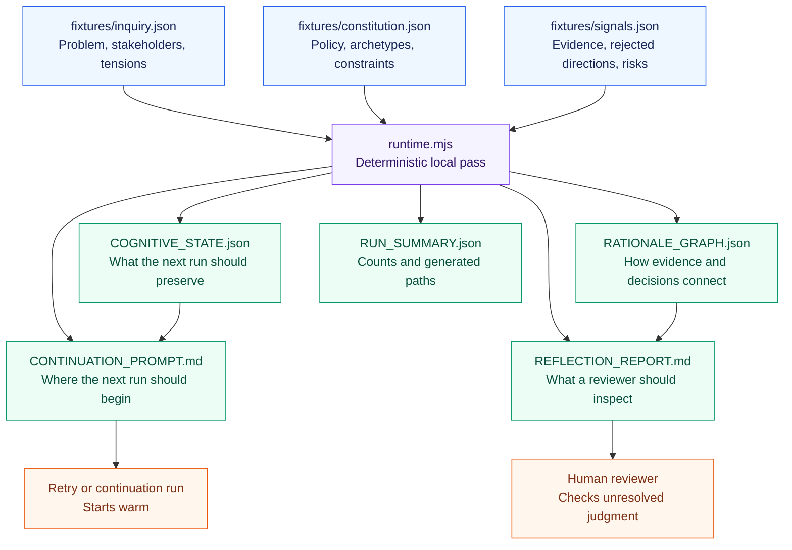
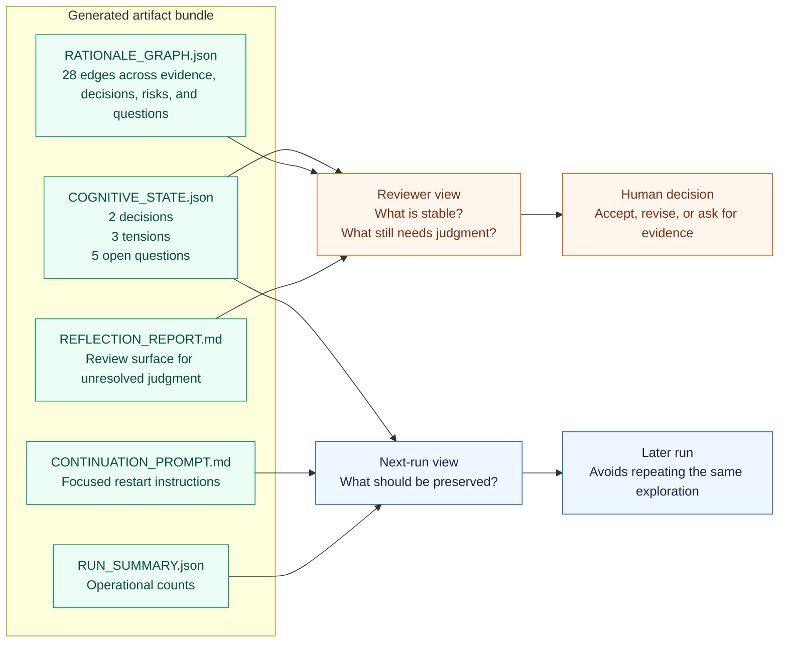

# Cognitive Harness

A dependency-free demo for cognition-shaped workspaces on top of Symphony primitives.

The demo runs a product onboarding inquiry through a tiny state machine. It writes preserved
cognitive state, a rationale graph, a reflection report, a continuation prompt, and a run summary.

Everything is local. It requires zero model calls, API keys, databases, or service setup.



## Why This Exists

Symphony already has useful bones: isolated workspaces, lifecycle hooks, retries, continuation, and
observability.

This demo asks a practical question:

```text
What structure should live inside a workspace so the next run can pick up the reasoning and start warm?
```

Continuity is the demo case. The wider harness problem includes tension preservation, recovery,
review surfaces, and domain adaptation.

The answer here is deliberately inspectable. The runtime turns 3 input files into 5 reviewable
artifacts.

Inputs:

- `fixtures/inquiry.json`: bounded problem, stakeholders, and tensions
- `fixtures/constitution.json`: preservation policy, archetypes, constraints, and reflection cadence
- `fixtures/signals.json`: simulated observations, rejected directions, questions, and risks

Outputs:

- `generated-workspace/COGNITIVE_STATE.json`
- `generated-workspace/RATIONALE_GRAPH.json`
- `generated-workspace/REFLECTION_REPORT.md`
- `generated-workspace/CONTINUATION_PROMPT.md`
- `generated-workspace/RUN_SUMMARY.json`

## Run

From the repository root:

```bash
node examples/cognitive-harness/runtime.mjs
```

The script reads fixtures and writes generated artifacts under:

```text
examples/cognitive-harness/generated-workspace/
```

Generated artifacts:

- `COGNITIVE_STATE.json`
- `RATIONALE_GRAPH.json`
- `REFLECTION_REPORT.md`
- `CONTINUATION_PROMPT.md`
- `RUN_SUMMARY.json`

For the full walkthrough, read `CASE_STUDY.md`.

For the state contract, read `SPEC.md`.

For guidance on making your own version, read `ADAPT.md`.

For guidance on wiring this into a real harness, read `INTEGRATE.md`.

For generated artifacts from one run, read `sample-output/`.



## How To Read The Output

Start with `REFLECTION_REPORT.md` if you want the human review surface.

Start with `COGNITIVE_STATE.json` if you want the next-run state.

Start with `RATIONALE_GRAPH.json` if you want to see how evidence, tensions, decisions, questions,
and risks connect.

Start with `CONTINUATION_PROMPT.md` if you want to see how a later run should resume.

## Example Output

```text
Cognitive Harness pass complete

Generated artifacts:
- generated-workspace/COGNITIVE_STATE.json
- generated-workspace/RATIONALE_GRAPH.json
- generated-workspace/REFLECTION_REPORT.md
- generated-workspace/CONTINUATION_PROMPT.md
- generated-workspace/RUN_SUMMARY.json

Key results:
- 2 decision(s) preserved
- 3 tension(s) preserved
- 5 open question(s) preserved
- 28 rationale graph edge(s)
```

Reflection excerpt:

```text
Preserved tension is a governance signal. It marks where a future run or human reviewer needs
explicit judgment.
```

Continuation excerpt:

```text
Run a focused review of the active tensions before selecting a primary concept direction.
```

Reset generated output:

```bash
node examples/cognitive-harness/runtime.mjs --reset
```

## Folder Structure

```text
examples/cognitive-harness/
  README.md
  CASE_STUDY.md
  SPEC.md
  ADAPT.md
  INTEGRATE.md
  runtime.mjs
  fixtures/
    constitution.json
    inquiry.json
    signals.json
  sample-output/
    COGNITIVE_STATE.json
    RATIONALE_GRAPH.json
    REFLECTION_REPORT.md
    CONTINUATION_PROMPT.md
    RUN_SUMMARY.json
  generated-workspace/
    .gitignore
    .gitkeep
```

## How It Maps To Symphony

| Symphony primitive | Demo role |
| --- | --- |
| `WORKFLOW.md` | `constitution.json`, the workspace operating policy |
| Issue | `inquiry.json`, the bounded problem space |
| Workspace | `generated-workspace/`, the persistent state boundary |
| Agent | reasoning archetypes in the constitution |
| Retry | recovery from preserved state |
| Observability | rationale graph, reflection report, run summary |
| Human review | explicit judgment over unresolved questions |

## State Model

The runtime writes 5 artifacts:

- `COGNITIVE_STATE.json`: preserved inquiry state for the next run
- `RATIONALE_GRAPH.json`: evidence, decisions, tensions, questions, and risks as nodes and edges
- `REFLECTION_REPORT.md`: human-readable review surface
- `CONTINUATION_PROMPT.md`: warm-start prompt for a later run
- `RUN_SUMMARY.json`: small operational summary

The generated files are ignored by git. Run the demo to regenerate them.

## What The Demo Produces

1. The inquiry enters a bounded workspace.
2. The constitution defines what should be preserved.
3. The runtime reads evidence, tensions, questions, and risks.
4. It writes a state artifact and a rationale graph.
5. It writes a reflection report for human review.
6. It writes a continuation prompt for the next run.

It is a working state model. Small enough to inspect. Big enough to show the shape.

## Next Places To Build

- Replace simulated signals with real Symphony run traces.
- Add schema validation for state and graph artifacts.
- Write state from lifecycle hooks after failure, review, or handoff.
- Visualize the rationale graph in a reviewer-friendly way.
- Compare multiple runs to find recurring unresolved tensions.
