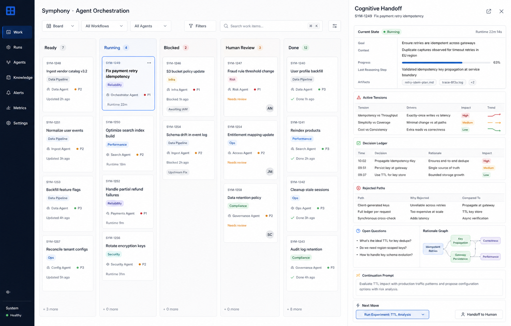

# UI Concept

Cognitive Harness does not need to replace Symphony's existing tracker-shaped workflow.

The useful UI move is to add a reasoning surface to each unit of work:

```text
kanban card shows where the work is
cognitive handoff shows what the work now knows
```

Symphony already fits an issue-board mental model: work moves through tracker states, the
orchestrator dispatches eligible issues, and the dashboard exposes running, retrying, blocked, and
review states. Cognitive Harness should sit under that model as a per-workspace inspection surface.



Illustrative mockup: a Symphony-style board keeps the operational overview, while a selected issue
opens a Cognitive Handoff drawer with preserved reasoning state.

## Product Shape

The primary object is still the issue or workspace. The added surface is a drawer, tab, or review
panel for the selected work item.

Useful sections:

- `Current State`: compact goal, context, progress, last reasoning step, and linked artifacts.
- `Active Tensions`: unresolved tradeoffs that need explicit judgment.
- `Decision Ledger`: stable decisions with rationale, evidence, and impact.
- `Rejected Paths`: directions a future run should not rediscover without new evidence.
- `Open Questions`: unresolved questions with blocker or confidence status.
- `Rationale Graph`: small visual map of decisions, evidence, tensions, risks, and questions.
- `Continuation Prompt`: the exact warm-start prompt a later run would receive.
- `Next Move`: the recommended action, such as retry, run experiment, hand off, or request review.

## Why This Belongs In The Branch

The existing demo already writes the artifacts a UI would need:

- `COGNITIVE_STATE.json` drives current state, decisions, tensions, risks, and open questions.
- `RATIONALE_GRAPH.json` drives graph and relationship views.
- `REFLECTION_REPORT.md` drives the human review narrative.
- `CONTINUATION_PROMPT.md` drives restart and handoff actions.
- `RUN_SUMMARY.json` drives counts, timestamps, and generated-path metadata.

This keeps the UI concept downstream of the artifact contract. The branch is not proposing a rich
web UI for Symphony itself; it is showing why the artifact shape is useful to an operator-facing
review surface.

## Interaction Model

1. An operator scans the normal board or dashboard.
2. A work item enters `Blocked`, `Retrying`, or `Human Review`.
3. The operator opens the Cognitive Handoff surface for that item.
4. The operator inspects active tensions, rejected paths, and the continuation prompt.
5. The operator chooses the next action: continue, retry, edit prompt, assign human review, or mark
   a decision as accepted.

The strongest review moment is not "what happened?" but "what is now safe to continue from?"

## Design Principles

- Preserve the tracker board as the operational overview.
- Keep reasoning state attached to a single workspace or issue.
- Prefer dense, inspectable records over chat-style prose.
- Make unresolved tension visible instead of hiding it in logs.
- Treat rejected paths as useful saved work.
- Show the continuation prompt before it is reused.
- Keep raw transcripts available, but do not make reviewers reconstruct state from them.

## Open UI Questions

- Should active tensions be editable by humans, or only derived from run artifacts?
- Should accepted decisions write back into `COGNITIVE_STATE.json` immediately?
- Should the continuation prompt be editable before retry?
- Which artifact should be the default entry point for human review?
- How should stale reasoning state be marked or invalidated?
